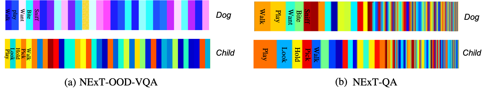

# NExT-OOD Dataset: Overcoming Dual Multiple-choice VQA Biases

In recent years, multiple-choice Visual Question Answering (VQA) has become topical and achieves great progress. However, most pioneer multiple-choice VQA models are heavily driven by statistical correlations in datasets, which cannot perform well on multimodal understanding and suffer from poor generalization. In this work, we identify two kinds of spurious correlations, i.e., a Vision-Answer bias (VA bias) and a Question-Answer bias (QA bias). To systematically and scientifically study these biases, we construct a new benchmark NExT-OOD in OOD setting. It is built upon the NExT-QA dataset and contains three sub-datasets including NExT-OOD-VA, NExT-OOD-QA, and NExT-OOD-VQA, which are designed for the VA bias, QA bias, and VA&QA bias, respectively.


## Code: 
We have released our NExT-OOD's evaluation code and our proposed debiasing method on **[Github]**(https://github.com/zhangxi1997/NExT-OOD).

## NExT-OOD-VQA
The NExT-OOD-VQA is built to simultaneously validate models’ generalization ability against the VA bias and QA bias.
The NExT-OOD-VQA auto dataset is also built to simultaneously validate models’ generalization ability against the VA bias and QA bias. Different from the NExT-OOD-VQA, this dataset is larger and is constructed in an automatic manner.



### Please download it from [Resources](https://drive.google.com/drive/folders/1As-cD-jE_S9j1Pk_CbUmKMAHFKPlLrZJ?usp=sharing)

## NExT-OOD-VA
The NExT-OOD-VA dataset is built to validate models’ generalization ability against the VA bias.

### Please download it from [Resources](https://drive.google.com/drive/folders/1set0QRbQcDYcEBRyTDyLNI9GrDhF2meT?usp=sharing)

## NExT-OOD-QA
The NExT-OOD-QA dataset is built to validate models’ generalization ability against the QA bias.

### Please download it from [Resources](https://drive.google.com/drive/folders/18CNV5M2awf6pKSkjKQ2wA0NFfr1uor3Q?usp=sharing)

## Other Resources

·[Pre-extracted video features](https://drive.google.com/file/d/1rS5X_t_VSDF4uP3HL1gPQ0ZgWIEuglgk/view?usp=sharing)

·[Pre-extracted BERT features](https://drive.google.com/file/d/11C7ANtHlP6szJmoJ2Z9x2VAHdFgASMDI/view?usp=sharing)

The training set of NExT-OOD is the same as NExT-QA, and can be found in [here](https://drive.google.com/drive/folders/1iLiKq_U_11E2tUJQouPS_MT_RAJbUF5q?usp=sharing).

## TEAM


```
@article{zhang2023nextoood,
    author    = {Zhang, Xi and Zhang, Feifei and Xu, Changsheng},
    title     = {NExT-OOD: Overcoming Dual Multiple-choice VQA Biases},
    booktitle = {IEEE Transactions on Pattern Analysis and Machine Intelligence (TPAMI)},
    year      = {2023}
}
```


